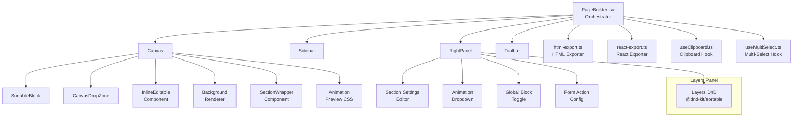

# Design Document: Page Builder Remaining Features

## Overview

This design covers the 12 remaining features for the Page Builder application, organized into five tiers: export (HTML & React), canvas improvements (drag-and-drop hit areas, inline editing, background rendering), block management (copy/paste, multi-select, layers DnD, global blocks), design enhancements (section settings, animation preview), and data handling (form submission). The architecture extends the existing `PageBuilder` orchestrator pattern — a single `BuilderState` managed via `useState`/`useCallback` hooks, with `localStorage` persistence, `@dnd-kit` for drag-and-drop, HeroUI v3 for UI controls, and Tailwind CSS v4 for styling.

Each feature is designed as an isolated module or component extension that plugs into the existing architecture without restructuring the core state flow. New modules (exporters, clipboard manager, selection manager) are pure functions or lightweight hooks, keeping the `PageBuilder.tsx` orchestrator as the single source of truth.

## Architecture

### High-Level Module Map



### Data Flow

All state flows through `PageBuilder.tsx`. New features follow the same pattern:

1. **User action** → event handler in `PageBuilder.tsx`
2. **State update** → `setState()` with `pushHistory()` for undo support
3. **Persistence** → `useEffect` syncs to `localStorage` via `savePages()`
4. **Rendering** → child components receive state as props

Export modules (`html-export.ts`, `react-export.ts`) are pure functions that take `BlockInstance[]`, `DesignSettings`, and `PageSettings` as input and produce string output. They have no side effects beyond triggering a browser download.

## Components and Interfaces

### 1. HTML Exporter (`src/page-builder/html-export.ts`)

Pure function module. No React component — called from toolbar/menu action.

```typescript
interface HtmlExportOptions {
  blocks: BlockInstance[];
  design: DesignSettings;
  pageSettings: PageSettings;
}

function generateHtml(options: HtmlExportOptions): string;
function downloadHtml(html: string, filename: string): void;
```

**Block-to-HTML mapping**: A `Record<BlockType, (props, design) => string>` maps each of the 24 block types to an HTML string generator. Unsupported types emit `<!-- Unsupported block: {type} -->`.

**Design token injection**: The generated `<html>` element gets CSS custom properties for `--main-color`, `--radius`, `--font-family`, mood class (`light`/`dark`), and background theme styles on `<body>`.

**Font inclusion**: A `<link>` tag for the selected Google Font from `FONT_URLS` in the `<head>`.

**Custom code injection**: `pageSettings.headCode` in `<head>`, `pageSettings.bodyCode` before `</body>`, `pageSettings.customCSS` in a `<style>` tag.

### 2. React Exporter (`src/page-builder/react-export.ts`)

Pure function module, same pattern as HTML exporter.

```typescript
interface ReactExportOptions {
  blocks: BlockInstance[];
  design: DesignSettings;
  pageSettings: PageSettings;
}

function generateReactComponent(options: ReactExportOptions): string;
function downloadReactFile(content: string, filename: string): void;
```

**Output**: A single `.tsx` file with a functional component. Uses inline styles for design tokens (no external CSS dependencies). Includes a comment header with page title and timestamp. The generated JSX mirrors `BlockRenderer` structure but as static markup.

### 3. Enhanced Canvas Drop Zones

Extends the existing `CanvasDropZone` component in `Canvas.tsx`.

```typescript
// New prop on Canvas
interface CanvasProps {
  // ... existing props
  isDragActive: boolean; // passed from PageBuilder DnD state
}
```

**Behavior**: When `isDragActive` is true, drop zones expand from `h-3` (12px) to `min-h-[32px]` with a smooth transition. Proximity detection uses the existing `@dnd-kit` collision detection — the custom `pointerWithin` + `rectIntersection` fallback already handles this. The visual indicator (highlighted line + label) is already partially implemented; this enhances it with a more prominent insertion line.

### 4. Inline Canvas Editing (`src/page-builder/components/InlineEditable.tsx`)

New component wrapping text elements in `BlockRenderer`.

```typescript
interface InlineEditableProps {
  value: string;
  field: string; // prop key name (e.g., "headline")
  blockId: string;
  multiline?: boolean; // true for "content"/"body" fields
  className?: string;
  onSave: (blockId: string, field: string, value: string) => void;
}
```

**Behavior**: Renders text normally. On double-click of a selected block's text, switches to `contentEditable`. Shows a subtle highlight. Commits on blur, Escape, or Enter (single-line). The `onSave` callback flows up to `updateBlockProps` in `PageBuilder.tsx`.

**Supported fields per block type** (from Requirement 3.5):

- hero: headline, subtitle, ctaText
- text: content
- content: heading, body
- cta: headline, subtitle, ctaText
- banner: text
- footer: copyright
- features/testimonials/pricing/faq/team/gallery/contact/logos: title

### 5. Background Renderer

Integrated into `Canvas.tsx` on the page preview container `<div>`.

```typescript
function getBackgroundStyles(design: DesignSettings): React.CSSProperties;
```

Returns CSS properties for:

- **solid**: Simple background-color based on mood
- **pattern**: SVG pattern as `backgroundImage` using `mainColor` at `backgroundOpacity / 100` opacity
- **gradient**: Linear gradient using `mainColor` at `backgroundOpacity / 100`

### 6. Section Wrapper (`src/page-builder/components/SectionWrapper.tsx`)

Wraps each block in the Canvas, reading `block.props._section`.

```typescript
interface SectionSettings {
  layout: "contained" | "full-width";
  bgImage: string;
  bgOverlay: string; // CSS color with alpha
}

interface SectionWrapperProps {
  section?: SectionSettings;
  children: React.ReactNode;
}
```

### 7. Clipboard Hook (`src/page-builder/hooks/useClipboard.ts`)

```typescript
interface ClipboardState {
  copiedBlock: { type: BlockType; props: Record<string, unknown> } | null;
}

function useClipboard(): {
  copiedBlock: ClipboardState["copiedBlock"];
  copy: (block: BlockInstance) => void;
  paste: (afterBlockId: string | null) => BlockInstance | null;
};
```

Stores copied block data in a module-level variable (survives page switches within session). `paste()` returns a new `BlockInstance` with a fresh ID and deep-cloned props.

### 8. Multi-Select Hook (`src/page-builder/hooks/useMultiSelect.ts`)

```typescript
function useMultiSelect(): {
  selectedIds: Set<string>;
  isMultiSelect: boolean;
  toggle: (id: string, shiftKey: boolean) => void;
  selectSingle: (id: string) => void;
  clear: () => void;
  selectRange: (fromId: string, toId: string, allIds: string[]) => void;
};
```

Integrates with `PageBuilder.tsx` — when `isMultiSelect` is true, the `RightPanel` shows a bulk actions summary instead of individual block properties.

### 9. Animation Preview

CSS-only approach using Tailwind `@keyframes` and a trigger mechanism.

```typescript
// Animation presets stored in block.props._animation
type AnimationPreset =
  | "none"
  | "fade-in"
  | "fade-up"
  | "fade-down"
  | "slide-up"
  | "slide-down"
  | "slide-left"
  | "slide-right"
  | "zoom-in"
  | "zoom-out"
  | "bounce";

// CSS keyframes map
const ANIMATION_KEYFRAMES: Record<AnimationPreset, string>;
```

**Canvas preview**: When animation changes or "Preview" is clicked, a CSS class is toggled that plays the animation once. The block returns to its final visible state after the animation completes.

**HTML export**: Includes `@keyframes` definitions and an Intersection Observer script that adds animation classes when blocks scroll into view.

### 10. Layers Panel DnD

Extends the existing Layers Panel in `RightPanel.tsx` with `@dnd-kit/sortable`.

```typescript
// Layers panel items become sortable
<SortableContext items={blockIds} strategy={verticalListSortingStrategy}>
  {blocks.map(block => <SortableLayerItem key={block.id} block={block} />)}
</SortableContext>
```

Reuses the same `DndContext` pattern from the Canvas. Reorder events call `pushHistory()` then update `state.blocks` via a callback.

### 11. Global Blocks

Stored as a flag in block props: `block.props._global: true`.

```typescript
// In PageBuilder.tsx — computed before rendering
function resolveGlobalBlocks(
  pages: Page[],
  activePageId: string,
): BlockInstance[];
```

**Resolution logic**: Scans all pages for blocks with `_global: true`. Prepends global navbars and appends global footers to the active page's blocks if the active page doesn't already contain a block with that global block's ID. Edits to a global block propagate by updating the source block in the page where it's defined.

### 12. Form Action Config

Extension to `RightPanel.tsx` for contact blocks.

```typescript
interface FormAction {
  method: "email" | "webhook" | "localStorage";
  email?: string;
  webhookUrl?: string;
}
// Stored in block.props._formAction
```

The HTML exporter generates corresponding JavaScript: `mailto:` for email, `fetch()` POST for webhook, `localStorage.setItem()` for localStorage.

## Data Models

### Extended BlockInstance Props

Several features store data in reserved `_`-prefixed keys within `block.props`:

```typescript
interface BlockInstance {
  id: string;
  type: BlockType;
  props: Record<string, unknown> & {
    _styles?: Record<string, string>; // Block style overrides (existing)
    _section?: {
      // Section settings (Req 5)
      layout: "contained" | "full-width";
      bgImage: string;
      bgOverlay: string;
    };
    _animation?: AnimationPreset; // Animation preset (Req 8)
    _global?: boolean; // Global block flag (Req 10)
    _formAction?: {
      // Form handler config (Req 11)
      method: "email" | "webhook" | "localStorage";
      email?: string;
      webhookUrl?: string;
    };
  };
}
```

### Animation Preset Type

```typescript
type AnimationPreset =
  | "none"
  | "fade-in"
  | "fade-up"
  | "fade-down"
  | "slide-up"
  | "slide-down"
  | "slide-left"
  | "slide-right"
  | "zoom-in"
  | "zoom-out"
  | "bounce";
```

### Clipboard State (module-level, not persisted)

```typescript
let clipboardStore: {
  type: BlockType;
  props: Record<string, unknown>;
} | null = null;
```

### Multi-Select State

```typescript
// Managed by useMultiSelect hook, stored in PageBuilder state
interface MultiSelectState {
  selectedIds: Set<string>;
}
```

### Export Output Structures

Both exporters produce strings — no new persisted data models. The HTML exporter output is a complete `<!DOCTYPE html>` document. The React exporter output is a `.tsx` file string.

### Background Styles

No new data model — uses existing `DesignSettings.backgroundTheme`, `DesignSettings.backgroundOpacity`, and `DesignSettings.mainColor` fields already defined in `types.ts`.

## Correctness Properties

_A property is a characteristic or behavior that should hold true across all valid executions of a system — essentially, a formal statement about what the system should do. Properties serve as the bridge between human-readable specifications and machine-verifiable correctness guarantees._

### Property 1: HTML export produces a structurally valid document for any block set

_For any_ valid array of `BlockInstance` objects and any valid `DesignSettings`, calling `generateHtml()` SHALL produce a string that contains a `<!DOCTYPE html>` declaration, `<html>`, `<head>`, and `<body>` tags, and contains one rendered section (or placeholder comment) per block in the input array.

**Validates: Requirements 1.1, 1.7**

### Property 2: HTML export reflects design settings

_For any_ valid `DesignSettings` (any mood, mainColor, backgroundTheme, backgroundOpacity, typography, radius combination), the generated HTML SHALL contain: (a) a Google Font `<link>` element matching the typography value, (b) CSS custom properties or inline styles reflecting the mainColor, radius, and mood, and (c) background styles matching the backgroundTheme and backgroundOpacity.

**Validates: Requirements 1.2, 1.3, 4.5**

### Property 3: HTML export preserves block style overrides

_For any_ `BlockInstance` with a non-empty `_styles` prop containing arbitrary CSS property/value pairs, the generated HTML for that block SHALL contain each style property and value as inline CSS on the corresponding element.

**Validates: Requirements 1.4**

### Property 4: HTML export includes custom page code in correct locations

_For any_ `PageSettings` with non-empty `customCSS`, `headCode`, and `bodyCode` strings, the generated HTML SHALL contain: (a) `customCSS` within a `<style>` tag inside `<head>`, (b) `headCode` inside `<head>`, and (c) `bodyCode` before the closing `</body>` tag.

**Validates: Requirements 1.5**

### Property 5: Background style generation matches theme type

_For any_ valid `DesignSettings`, `getBackgroundStyles()` SHALL return: (a) a solid background-color when `backgroundTheme` is "solid", (b) a pattern `backgroundImage` using `mainColor` at `backgroundOpacity/100` opacity when `backgroundTheme` is "pattern", or (c) a gradient `background` using `mainColor` at `backgroundOpacity/100` opacity when `backgroundTheme` is "gradient".

**Validates: Requirements 4.1, 4.2, 4.3**

### Property 6: Section wrapper applies background image and overlay

_For any_ block with a `_section` prop containing a non-empty `bgImage` URL, the `SectionWrapper` SHALL render a `background-image` CSS property with `cover` sizing and `center` positioning. _For any_ block with a non-empty `bgOverlay` color, the wrapper SHALL render a semi-transparent overlay element with that color.

**Validates: Requirements 5.4, 5.5**

### Property 7: HTML export includes section settings per block

_For any_ block with `_section` settings (layout mode, bgImage, bgOverlay), the generated HTML SHALL contain the corresponding layout wrapper (full-width or contained), background-image style, and overlay element for that block.

**Validates: Requirements 5.7**

### Property 8: Clipboard copy-paste round trip preserves block data

_For any_ `BlockInstance`, copying it to the clipboard and then pasting SHALL produce a new block with: (a) a different `id` than the original, (b) the same `type`, and (c) `props` that are deeply equal to the original but not reference-equal (deep clone).

**Validates: Requirements 6.1, 6.2**

### Property 9: Inline editing save preserves entered text

_For any_ non-empty text string entered into an `InlineEditable` component, committing the edit (via blur or Escape) SHALL invoke the `onSave` callback with the exact text content, the correct `blockId`, and the correct `field` name.

**Validates: Requirements 3.3**

### Property 10: Multi-select shift-click toggles membership correctly

_For any_ sequence of block IDs and shift-click toggle operations, the resulting selection set SHALL contain exactly the block IDs that have been toggled an odd number of times (added but not removed).

**Validates: Requirements 7.1**

### Property 11: Multi-select bulk delete removes exactly the selected blocks

_For any_ blocks array and any non-empty subset of selected block IDs, performing a bulk delete SHALL produce a blocks array containing exactly the blocks whose IDs were not in the selection set, in their original relative order.

**Validates: Requirements 7.3**

### Property 12: Multi-select bulk duplicate inserts copies in order after last selected

_For any_ blocks array and any non-empty subset of selected block IDs, performing a bulk duplicate SHALL insert copies of the selected blocks immediately after the last selected block, in the same relative order as the originals, each with a unique new ID and deeply cloned props.

**Validates: Requirements 7.4**

### Property 13: HTML export includes animation keyframes for animated blocks

_For any_ block with a non-"none" `_animation` preset value, the generated HTML SHALL contain: (a) a CSS `@keyframes` definition corresponding to that animation preset, and (b) Intersection Observer JavaScript that applies the animation class when the block scrolls into view.

**Validates: Requirements 8.4**

### Property 14: Layers panel reorder produces correct block order

_For any_ blocks array and any valid source/target index pair, reordering a block from the source index to the target index SHALL produce a blocks array where the moved block is at the target position and all other blocks maintain their relative order.

**Validates: Requirements 9.2**

### Property 15: Global block resolution prepends navbars and appends footers

_For any_ set of pages where some navbar/footer blocks have `_global: true`, resolving global blocks for a target page SHALL: (a) prepend global navbar blocks that are not already present on the target page, and (b) append global footer blocks that are not already present on the target page, without duplicating blocks already on the page.

**Validates: Requirements 10.4**

### Property 16: Global block edit propagation

_For any_ global block and any prop change applied to it, all pages that reference that global block SHALL reflect the updated props after propagation.

**Validates: Requirements 10.5**

### Property 17: HTML export generates correct form submission code

_For any_ contact block with a configured `_formAction`, the generated HTML SHALL contain form submission JavaScript matching the method: `mailto:` link construction for "email", `fetch()` POST to the webhook URL for "webhook", or `localStorage.setItem()` for "localStorage".

**Validates: Requirements 11.5**

### Property 18: React export generates a valid component with design settings

_For any_ valid array of `BlockInstance` objects and any valid `DesignSettings`, `generateReactComponent()` SHALL produce a string that: (a) is syntactically valid TypeScript JSX, (b) contains a functional React component, (c) includes CSS custom properties for mood, mainColor, typography, and radius on the root element, and (d) contains JSX markup for each block in the input array.

**Validates: Requirements 12.1, 12.2, 12.3, 12.6**

### Property 19: React export includes comment header

_For any_ page title string, the generated React component file SHALL begin with a comment header containing the page title and a valid ISO 8601 timestamp.

**Validates: Requirements 12.4**

## Error Handling

### Export Errors

- **HTML/React export with empty blocks array**: Generate a valid but empty document/component with only the design settings applied. No error thrown.
- **Unknown block type in export**: HTML exporter renders `<!-- Unsupported block: {type} -->`. React exporter renders `{/* Unsupported block: {type} */}`. No error thrown.
- **Invalid design settings values**: Exporters use fallback defaults (e.g., "Inter" for unknown typography, "0.5rem" for unknown radius). Existing `radiusValue()` helper already handles this pattern.
- **Download failure** (e.g., popup blocked): Catch the error and show a toast notification via HeroUI's Toast component. Provide the generated content as a fallback (e.g., copy to clipboard).

### Canvas Errors

- **Invalid background image URL in section settings**: CSS `background-image` with an invalid URL simply doesn't render — no error. The SectionWrapper shows the block content without a background.
- **ContentEditable XSS**: The `InlineEditable` component reads `textContent` (not `innerHTML`) to prevent script injection. Only plain text is saved to block props.
- **Animation CSS conflicts**: Each animation preview removes the previous animation class before applying the new one. The `animationend` event listener cleans up the class.

### Clipboard Errors

- **Paste with empty clipboard**: No-op. No error, no state change.
- **Paste of block with stale references** (e.g., global block ID that no longer exists): The pasted block gets a fresh ID and `_global` is set to `false` to prevent orphaned global references.

### Multi-Select Errors

- **Delete all blocks**: Allowed — results in an empty canvas with the "Start building" placeholder.
- **Shift-click on a block that was just deleted** (race condition): The selection manager filters out IDs not present in the current blocks array before performing operations.

### Global Block Errors

- **Circular global references** (global block on page A references page B which references page A): The `resolveGlobalBlocks` function only looks at blocks with `_global: true` on their source page. It does not recursively resolve, preventing cycles.
- **Deleting a page that contains the source global block**: Global blocks on other pages become independent (the `_global` flag remains but the source is gone). A cleanup pass removes orphaned global references on next page load.

### Form Action Errors

- **Invalid email address or webhook URL**: Validated client-side with basic format checks in the RightPanel input fields. The HTML exporter generates the code regardless — runtime validation happens in the exported page.
- **No form action configured**: Defaults to localStorage with a key derived from `{pageSlug}-{blockId}`.

## Testing Strategy

### Property-Based Testing

This feature set is well-suited for property-based testing, particularly the pure function modules (exporters, clipboard, selection logic, global block resolution, background style generation).

**Library**: [fast-check](https://github.com/dubzzz/fast-check) — the standard PBT library for TypeScript/JavaScript.

**Configuration**: Each property test runs a minimum of 100 iterations with generated inputs.

**Tag format**: Each test includes a comment referencing its design property:

```typescript
// Feature: page-builder-remaining-features, Property 1: HTML export produces a structurally valid document for any block set
```

**Custom generators needed**:

- `arbBlockInstance()`: Generates a random `BlockInstance` with a valid `BlockType` and plausible props for that type
- `arbDesignSettings()`: Generates a random `DesignSettings` with valid mood, mainColor (hex), backgroundTheme, backgroundOpacity (0–100), typography, and radius values
- `arbPageSettings()`: Generates a random `PageSettings` with string fields
- `arbSectionSettings()`: Generates random `_section` props
- `arbFormAction()`: Generates random `_formAction` configurations
- `arbAnimationPreset()`: Picks from the `AnimationPreset` union

### Unit Tests (Example-Based)

Unit tests cover specific scenarios, UI interactions, and edge cases not suited for PBT:

- **Drop zone expansion**: Verify CSS class changes when `isDragActive` toggles (Req 2.1, 2.2)
- **Inline editing activation**: Double-click enables contentEditable, Enter commits single-line edits (Req 3.1, 3.2, 3.4)
- **Inline editing field mapping**: Verify correct fields are editable per block type (Req 3.5)
- **Background update timing**: Verify synchronous re-render on design change (Req 4.4)
- **Section settings UI**: Verify controls appear for all block types (Req 5.1, 5.2, 5.3)
- **Clipboard cross-page persistence**: Copy on page A, switch to page B, paste works (Req 6.5)
- **Multi-select visual indicators**: Badge/highlight rendering (Req 7.2, 7.5, 7.6)
- **Animation dropdown and preview**: UI controls and CSS class toggling (Req 8.1, 8.2, 8.3)
- **Layers panel DnD setup**: Sortable context and overlay rendering (Req 9.1, 9.3, 9.4)
- **Global block toggle and badge**: UI for navbar/footer only (Req 10.1, 10.2, 10.3)
- **Form action UI**: Method selector and conditional fields for contact blocks (Req 11.1–11.4)
- **Download triggers**: Mock download function, verify correct filenames (Req 1.6, 12.5)

### Edge Case Tests

- Empty clipboard paste (Req 6.4)
- Unknown block type in export (Req 1.7)
- No form action configured defaults to localStorage (Req 11.6)
- Removing global flag stops propagation (Req 10.6)
- Delete all blocks via multi-select
- ContentEditable with empty string (should revert to original value)
- Export with zero blocks (empty page)

### Integration Tests

- Full export flow: build a page with multiple block types → export HTML → verify the file is a complete, renderable document
- Full React export flow: build a page → export .tsx → verify it parses as valid TypeScript
- Global blocks across pages: create global navbar on page 1 → verify it appears on page 2 → edit on page 2 → verify page 1 reflects changes
- Copy/paste across pages: copy block on page 1 → switch to page 2 → paste → verify block appears
